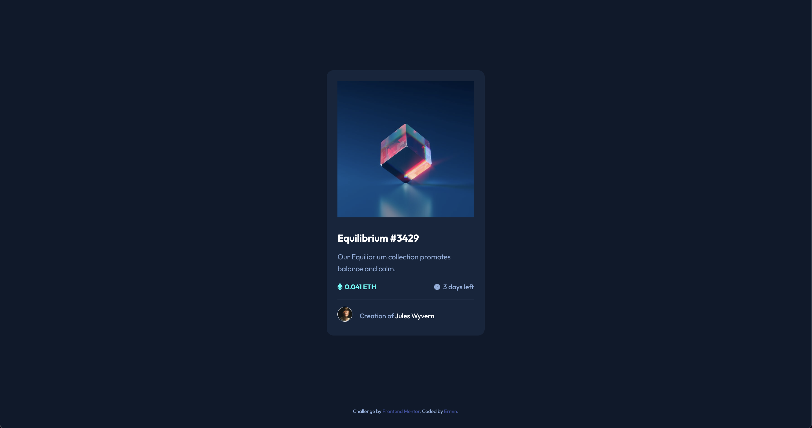

# Frontend Mentor - NFT preview card component solution

This is a solution to the [NFT preview card component challenge on Frontend Mentor](https://www.frontendmentor.io/challenges/nft-preview-card-component-SbdUL_w0U). Frontend Mentor challenges help you improve your coding skills by building realistic projects.

## Table of contents

- [Overview](#overview)
  - [The challenge](#the-challenge)
  - [Screenshot](#screenshot)
  - [Links](#links)
- [My process](#my-process)
  - [Built with](#built-with)
  - [What I learned](#what-i-learned)
  - [Continued development](#continued-development)
  - [Useful resources](#useful-resources)
- [Author](#author)
- [Acknowledgments](#acknowledgments)

**Note: Delete this note and update the table of contents based on what sections you keep.**

## Overview

### The challenge

Users should be able to:

- View the optimal layout depending on their device's screen size
- See hover states for interactive elements

### Screenshot

### Links

- Solution URL: [Add solution URL here](https://github.com/erminski/nft-card-component)
- Live Site URL: [Add live site URL here](https://vocal-eclair-033d3a.netlify.app/)

## My process

### Built with

- Semantic HTML5 markup
- CSS custom properties
- Flexbox
- Mobile-first workflow

### What I learned

- need to be more structured before starting to write code: look at all font-sizes, colors, etc and determine what styles are needed instead of looking them up all the time

### Continued development

- improve workflow
- overall, not too challenging
- next: build one more component with improved workflow

### Useful resources

- [Resource 1](https://magenta-belekoy-ec1d11.netlify.app/#https://www.twitter.com) - This project helped me to see how to implement the display of the icon upon hovering over the image container

## Author

- Website - [Ermin Mekic](https://app.netlify.com/teams/erminski/sites)
- Frontend Mentor - [@erminski](https://www.frontendmentor.io/profile/erminski)
- Twitter - [@yourusername](https://www.twitter.com/airminski)

## Acknowledgments

The "backroads" project from John Smilga's css course had lots of techniques I used for this nft card. Thanks, John.
